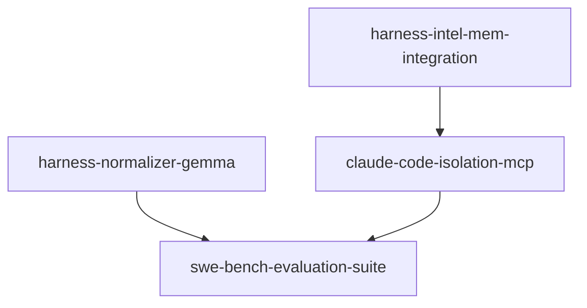

# Linked Roadmap: Local Agentic Development & SWE-bench Suite

## Phase DAG & Disjoint Ownership Table

| Phase ID | Dependencies | Owns (Exclusive Patterns) | Priority | Isolation | Verification Gate | Status |
|---|---|---|:---:|---|---|:---:|
| `harness-intel-mem-integration` | `[]` | `harness/src/coding.asl` `harness/src/local-exec.asl` `harness/tests/coding-test.asl` | **P0** | `single-tree` | `asl test harness/tests/coding-test.asl` | `pending` |
| `harness-normalizer-gemma` | `[]` | `harness/src/normalizer.asl` `harness/tests/normalizer-test.asl` | **P0** | `single-tree` | `asl test harness/tests/normalizer-test.asl` | `pending` |
| `claude-code-isolation-mcp` | `["harness-intel-mem-integration"]` | `harness/benchmark/run_claude_baseline.sh` `harness/benchmark/run_claude_genseam.sh` `harness/benchmark/mcp_bridge.asl` | **P1** | `single-tree` | `zsh -c 'harness/benchmark/run_claude_baseline.sh --check'` | `pending` |
| `swe-bench-evaluation-suite` | `["harness-normalizer-gemma", "claude-code-isolation-mcp"]` | `harness/src/swe-bench.asl` `harness/benchmark/run_comparison.sh` `harness/tests/swe-bench-test.asl` | **P1** | `single-tree` | `zsh -c 'harness/benchmark/run_comparison.sh --dry-run'` | `pending` |

## Wave Schedule
- **Wave 0 (Parallel Execution)**:
  - `harness-intel-mem-integration`
  - `harness-normalizer-gemma`
- **Wave 1**:
  - `claude-code-isolation-mcp`
- **Wave 2 (Benchmark Convergence)**:
  - `swe-bench-evaluation-suite`
