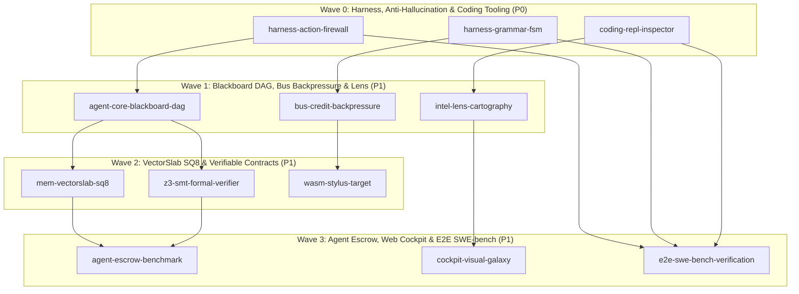

# Master Roadmap: Autonomous Cognitive Gateway & Execution Harness Ecosystem

## Phase DAG & Disjoint Ownership Table

| Phase ID | Wave | Priority | Dependencies | Owns (Exclusive Patterns) | Gate Command | Status |
|---|:---:|:---:|---|---|---|:---:|
| `harness-action-firewall` | **Wave 0** | **P0** | `[]` | `harness/src/firewall.asl` `harness/tests/firewall-test.asl` | `asl test harness/tests/firewall-test.asl` | `done` |
| `harness-grammar-fsm` | **Wave 0** | **P0** | `[]` | `harness/src/fsm-normalizer.asl` `harness/tests/fsm-normalizer-test.asl` | `asl test harness/tests/fsm-normalizer-test.asl` | `done` |
| `coding-repl-inspector` | **Wave 0** | **P0** | `[]` | `harness/src/repl.asl` `harness/tests/repl-test.asl` | `asl test harness/tests/repl-test.asl` | `done` |
| `agent-core-blackboard-dag` | **Wave 1** | **P1** | `["harness-action-firewall"]` | `agent-core/src/blackboard.asl` `agent-core/tests/blackboard-test.asl` | `asl test agent-core/tests/blackboard-test.asl` | `pending` |
| `bus-credit-backpressure` | **Wave 1** | **P1** | `["harness-grammar-fsm"]` | `agent-bus/src/backpressure.asl` `agent-bus/tests/backpressure-test.asl` | `asl test agent-bus/tests/backpressure-test.asl` | `pending` |
| `intel-lens-cartography` | **Wave 1** | **P1** | `["coding-repl-inspector"]` | `intel/src/lens.asl` `intel/tests/lens-test.asl` | `asl test intel/tests/lens-test.asl` | `pending` |
| `mem-vectorslab-sq8` | **Wave 2** | **P1** | `["agent-core-blackboard-dag"]` | `mem/src/vectorslab.asl` `mem/tests/vectorslab-test.asl` | `asl test mem/tests/vectorslab-test.asl` | `pending` |
| `z3-smt-formal-verifier` | **Wave 2** | **P1** | `["agent-core-blackboard-dag"]` | `asl/packages/asl-contracts/src/smt.asl` `asl/packages/asl-contracts/tests/smt_test.asl` | `asl test asl/packages/asl-contracts/tests/smt_test.asl` | `pending` |
| `wasm-stylus-target` | **Wave 2** | **P1** | `["bus-credit-backpressure"]` | `asl/packages/asl-contracts/src/stylus_abi.asl` `asl/packages/asl-contracts/tests/stylus_test.asl` | `asl test asl/packages/asl-contracts/tests/stylus_test.asl` | `pending` |
| `agent-escrow-benchmark` | **Wave 3** | **P1** | `["z3-smt-formal-verifier", "wasm-stylus-target"]` | `asl/packages/asl-contracts/examples/escrow.asl` `asl/packages/asl-contracts/tests/escrow_test.asl` | `asl test asl/packages/asl-contracts/tests/escrow_test.asl` | `pending` |
| `cockpit-visual-galaxy` | **Wave 3** | **P1** | `["intel-lens-cartography"]` | `web/src/components/CockpitGalaxy.asl` `web/tests/cockpit-test.asl` | `asl test web/tests/cockpit-test.asl` | `pending` |
| `e2e-swe-bench-verification` | **Wave 3** | **P1** | `["harness-action-firewall", "coding-repl-inspector"]` | `harness/benchmark/run_e2e_verified.sh` | `zsh -c 'harness/benchmark/run_e2e_verified.sh --check'` | `pending` |
